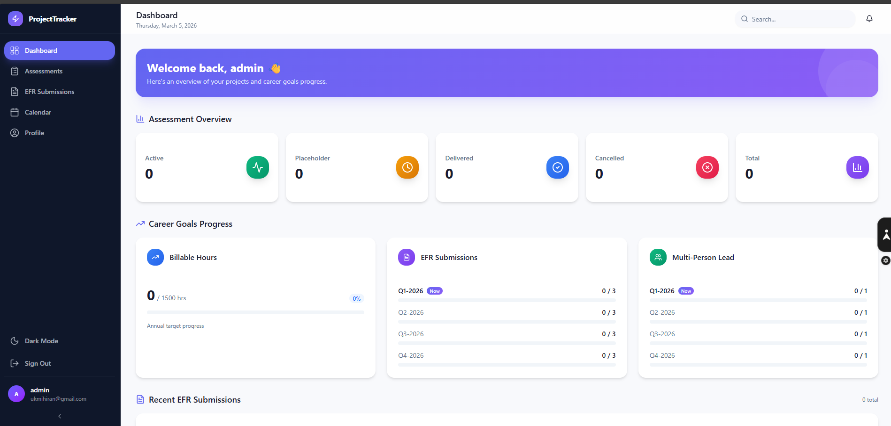

# ProjectTracker

A modern, minimalist project and career-goal tracking app built with Next.js.

## Preview



## Features

- Dashboard with assessment and goal progress overview
- EFR submissions and activity tracking
- Calendar and profile management
- Authentication with NextAuth
- Prisma-powered data layer

## Tech Stack

- Next.js 16 + React 19 + TypeScript
- Tailwind CSS + shadcn/ui
- Prisma ORM
- Jest + Testing Library

## Quick Start

```bash
pnpm install
pnpm dev
```

App runs at `http://localhost:3000`.

## Scripts

```bash
pnpm dev      # start dev server
pnpm build    # production build
pnpm start    # run production server
pnpm lint     # run linter
pnpm test     # run tests
```

## Project Structure

```text
src/app           # app routes, pages, and server actions
src/components    # shared UI and layout components
src/lib           # utilities, schemas, and database helpers
prisma            # database schema
public            # static assets
```

## License

Private project.
